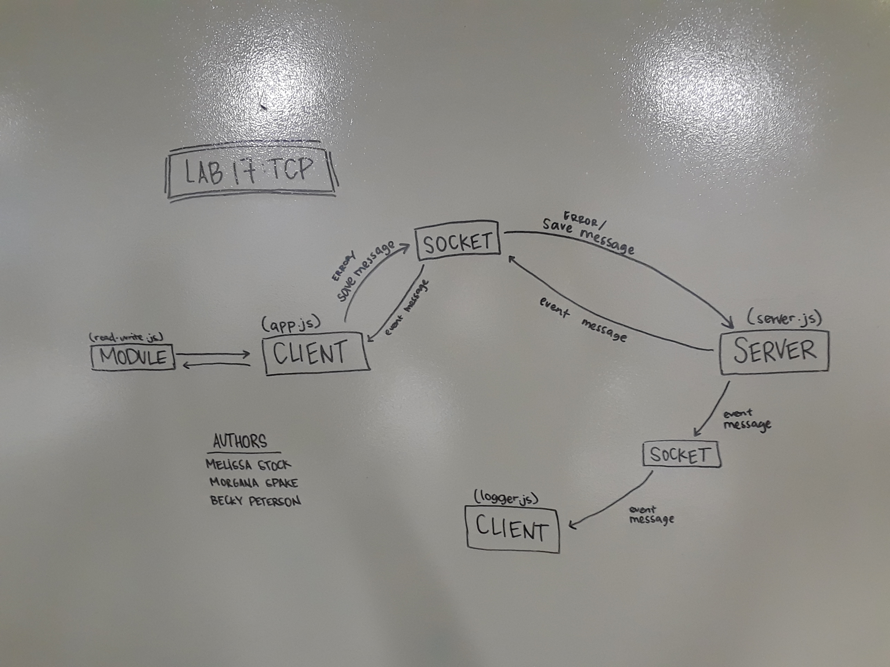

 LAB
=================================================

## Introduction to TCP

### Author: Melissa Stock

### Links and Resources
* [submission PR](https://github.com/401-advancedjs/tcp-server/pull/1)
* [travis](https://www.travis-ci.com/401-advancedjs/tcp-server)

#### Documentation
* [jsdoc](https://jsdoc.app/)
* [node net docs](https://nodejs.org/api/net.html#net_class_net_socket)

### Modules
#### `read-write.js`
#### `app.js`
#### `server.js`
#### `logger.js`

##### Exported Values and Methods

###### `read(file) -> buffer`

###### `upperCase(buffer) -> buffer`

###### `write(file, buffer) -> success message`

### Setup
#### `.env` requirements
* `PORT` - Port Number
* `CLIENT_NAME` - localhost

#### Running the app
* `node server.js`
* `node logger.js`
* `node app.js <file name>`
  
#### Tests
* How do you run tests? `npm test`
* What assertions were made?
    * No assertions were made
* What assertions need to be / should be made?
    * Tests around modules
    * Test for event handlers

#### UML

